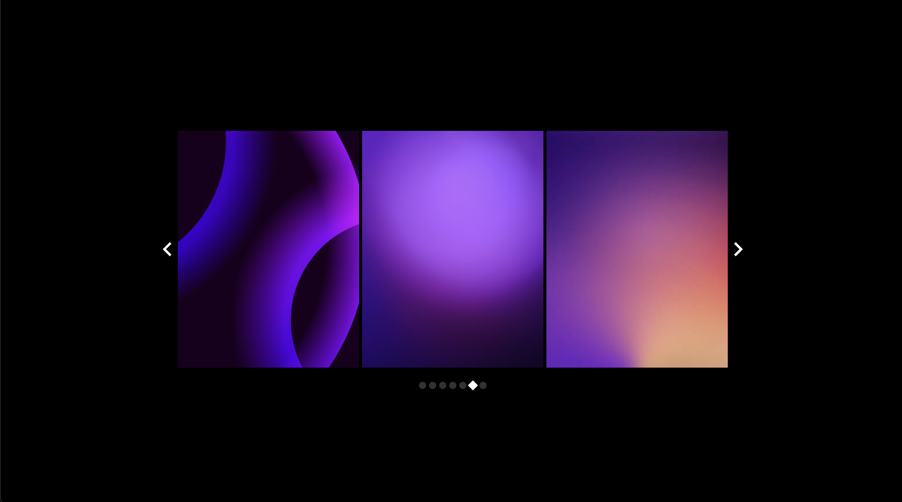

<h2 align="center">Hello, I'm Igor 😎</h2>
 

  I'm a Software Engineer 
  I love turning ideas into seamless, high-performance applications.  
What excites me the most is tackling complex challenges,
breaking them into smaller pieces, and finding elegant solutions.  
I thrive in creating clean, maintainable code while building intuitive and user-friendly experiences.  
Collaboration, mentorship, and innovation are what drive me to deliver impactful results.  
  
  
  📫 How to reach me:

  
  

 

<h1 align="center">🚀 Languages & Tools</h1>

<h3 align='center'>Frontend Development</h3>

<table align="center"> <tr> <td align="center" height="70" width="70">   HTML5 </td> <td align="center" height="70" width="70">   CSS3 </td> <td align="center" height="70" width="70">   JavaScript </td> <td align="center" height="70" width="70">   TypeScript </td> <td align="center" height="70" width="70">   React.js </td> </tr> <tr> <td align="center" height="70" width="70">   React Native </td> <td align="center" height="70" width="70">   Next.js </td> <td align="center" height="70" width="70">   Vue.js </td> <td align="center" height="70" width="70">   Redux.js </td> <td align="center" height="70" width="70">   MobX </td> </tr> </table>

<h3 align='center'>Frontend Styling</h3>

<table align="center"> <tr> <td align="center" height="70" width="70">   Tailwind CSS </td> <td align="center" height="70" width="70">   Material-UI </td> <td align="center" height="70" width="70">   Styled Components </td> <td align="center" height="70" width="70">   SASS </td> </tr> </table>

<h3 align='center'>Backend Development</h3>

<table align="center"> <tr> <td align="center" height="70" width="70">   Node.js </td> <td align="center" height="70" width="70">   Express.js </td> <td align="center" height="70" width="70">   NestJS </td> </tr> </table>

<h3 align='center'>Database Management</h3>

<table align="center"> <tr> <td align="center" height="70" width="70">   PostgreSQL </td> <td align="center" height="70" width="70">   MongoDB </td> </tr> </table>

<h3 align='center'>Testing & Development Tools</h3>

<table align="center"> <tr> <td align="center" height="70" width="70">   Cypress </td> <td align="center" height="70" width="70">   Storybook </td> <td align="center" height="70" width="70">   Vite </td> <td align="center" height="70" width="70">   Docker </td> <td align="center" height="70" width="70">   AWS</td> </tr> </table>

<h3 align='center'>Machine Learning</h3>

<table align="center"> <tr> <td align="center" height="70" width="70">   YOLO </td> <td align="center" height="70" width="70">   TensorFlow </td> </tr> </table>

 

<h1 align="center">Projects</h1>

<table>
  <tr>
    <td width='50%'>
      <h2 align='center'>Involved Admin Panel</h2>
      
  
        
         
         
        

          
        

        
<strong>React, TypeScript, Material-UI</strong>

      

    </td>
    <td width='50%'>
      <h2 align='center'>Involved Participants</h2>
      
  
        
         
         
        

          
        

        
<strong>React, TypeScript, Tailwind CSS</strong>

      

    </td>
  </tr>
    <tr>
    <td width='50%'>
      <h2 align='center'>SignScan</h2>
      
  
        
         
         
        

          
          
        

        
<strong>ReactNative, TypeScript, YOLO</strong>

      

    </td>
    <td width='50%'>
      <h2 align='center'>Weaponry</h2>
      
  
        
         
         
        

          
          
        

        
<strong>ReactNative, TypeScript, TensorFlow</strong>

      

    </td>
  </tr>
  <tr>
    <td width='50%'>
      <h2 align='center'>Chronous Landing</h2>
      
  
        
         
         
        

          
        

        
<strong>React, TypeScript, Next.js, Styled-Components</strong>

      

    </td>
    <td width='50%'>
      <h2 align='center'>Chronous</h2>
      
  
        
         
         
        

          
          
        

        
<strong>React, TypeScript</strong>

      

    </td>
  </tr>
  <tr>
    <td width='50%'>
      <h2 align='center'>Swipi Landing</h2>
      
  
        
         
         
        
        
<strong>React, TypeScript, Next.js, Chakra</strong>

      

    </td>
   <td width='50%'>
      <h2 align='center'>Swipi</h2>
      
  
        
         
         
        

          
          
        

        
<strong>React, TypeScript</strong>

      

    </td>
  </tr>
</table>
